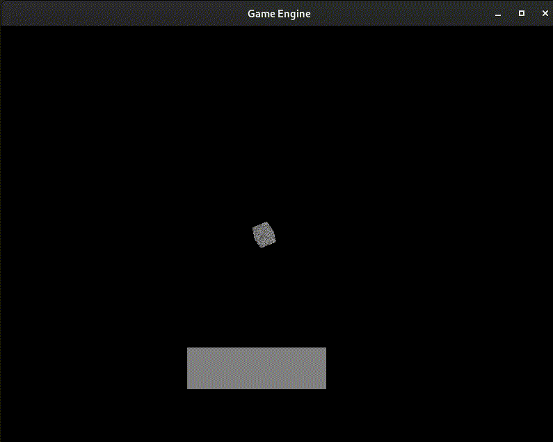
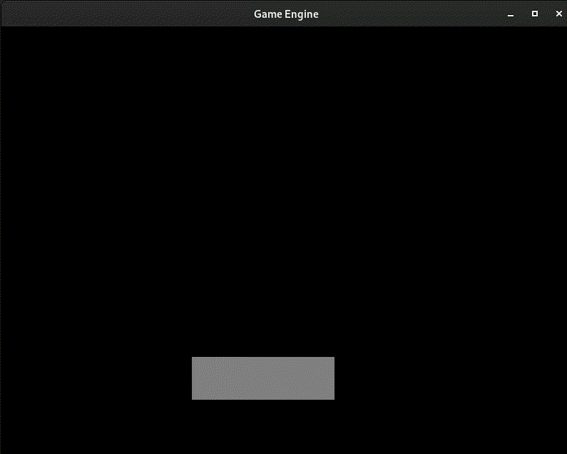

# protoengine

A work-in-progress game engine written in C++ with OpenGL, built and tested on Debian Linux.  
Includes practice code and concepts inspired by [learnopengl.com](https://learnopengl.com/).

## Updates

# UI dragging


# Buttons (UI)


# Object creation


## Features

- Written in C++ (with some C), with the main focus on learning c++ and opengl well.
- Using OpenGL (API) for graphics rendering.
- The Game engine is under active development, previous weeks have been spent learning. Some recent additions in 3D rendering, user interaction, UI systems.

## Requirements

- **Operating System:** Debian Linux (or similar)
- **Compiler:** g++ with C++17 support
- **Libraries:**
  - `glfw`
  - `GL`
  - `GLU`
  - `X11`
  - `pthread`
  - `Xrandr`
  - `Xi`
  - `dl`

Install dependencies on Debian/Ubuntu:
```sh
sudo apt-get install build-essential libglfw3-dev libglu1-mesa-dev libxi-dev libxrandr-dev libx11-dev
```

## Building & Running

1. Clone this repository:
    ```sh
    git clone https://github.com/ElliotFreebairn/protoengine.git
    cd protoengine/game-engine
    ```

2. Build and run using the provided Makefile:
    ```sh
    make run
    ```

    - To build only:
      ```sh
      make
      ```
    - The output binary/executable is named `program` by default (might later to something more appropiate).

## Project Structure

- `game-engine/src/` — Source code (.cpp/.c)
- `game-engine/includes/` — Headers and third-party libraries (e.g., GLM, GLFW)
- `game-engine/obj/` —  Object files generated from make

## Status

- Completed core tutorials from [learnopengl.com](https://learnopengl.com/)
- 3D functionality and object placement added
- Currently not much of a game engine, as I'm building the foundations, e.g. shaders, textures, window, object creation etc...
- Actively working on UI features and improving engine/game object structure.

## License

To:Do add a license (most likely MIT)

---
